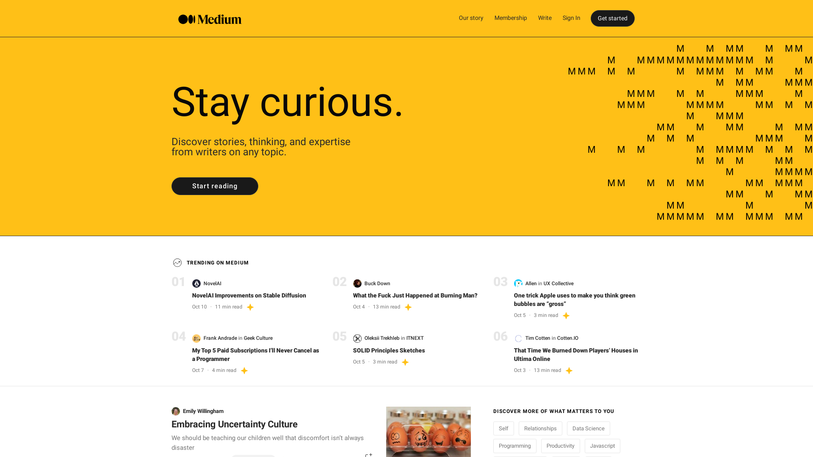

# Medium Clone Built with Bootstrap

Welcome to my project, where I've created a clone of Medium.com using Bootstrap. This project serves to demonstrate my skills in responsive web design, and more specifically, my understanding and practical application of the Bootstrap framework.

## Project Description

This repository houses the code for a Medium.com clone, a project that I built from scratch using Bootstrap. Medium is an online publishing platform known for its clean design and user-friendly interface. The goal of this project was to replicate the look and feel of Medium's website while focusing on a mobile-first approach and ensuring optimal responsiveness across various device sizes.

The project showcases my understanding of Bootstrap's core concepts such as its Grid System, components, and utility classes. It also demonstrates my ability to customize Bootstrap according to project requirements.

While this project does not include Medium's back-end functionality, it provides a visual and interactive interface that replicates the user experience as closely as possible.

Feel free to explore the code, suggest any improvements, or use it as a basis for your own projects. I appreciate any feedback or contribution!

## Table of contents

- [Overview](#overview)
  - [Screenshot](#screenshot)
  - [Links](#links)
- [My process](#my-process)
  - [Built with](#built-with)
  - [What I learned](#what-i-learned)

## Overview

### Screenshot



### Links

- Solution URL: [Solution URL here](https://medium.com/)
- Live Site URL: [Live site URL here](https://berkcan-medium-clone.netlify.app/)

## My process

### Built with

- Semantic HTML5 markup
- CSS custom properties
- Flexbox
- Mobile-first workflow

### What I learned

```html
<div class="container"></div>
```

```css
:root {
  --white: hsl(0, 0%, 100%);
  --lightgray: hsl(212, 45%, 89%);
  --grayishblue: hsl(220, 15%, 55%);
  --darkblue: hsl(218, 44%, 22%);
}

.container .text .hero {
  color: var(--darkblue);
}
```
